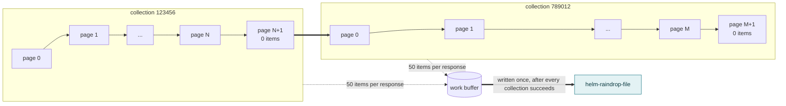
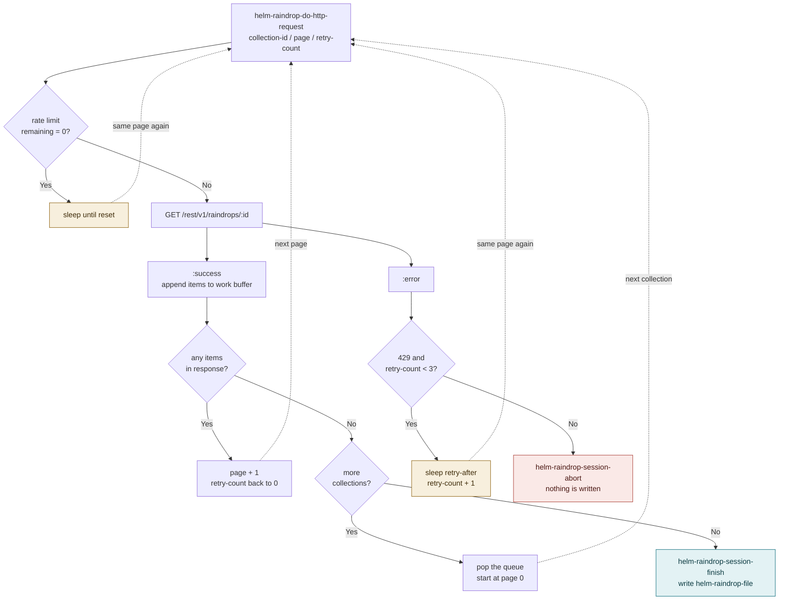
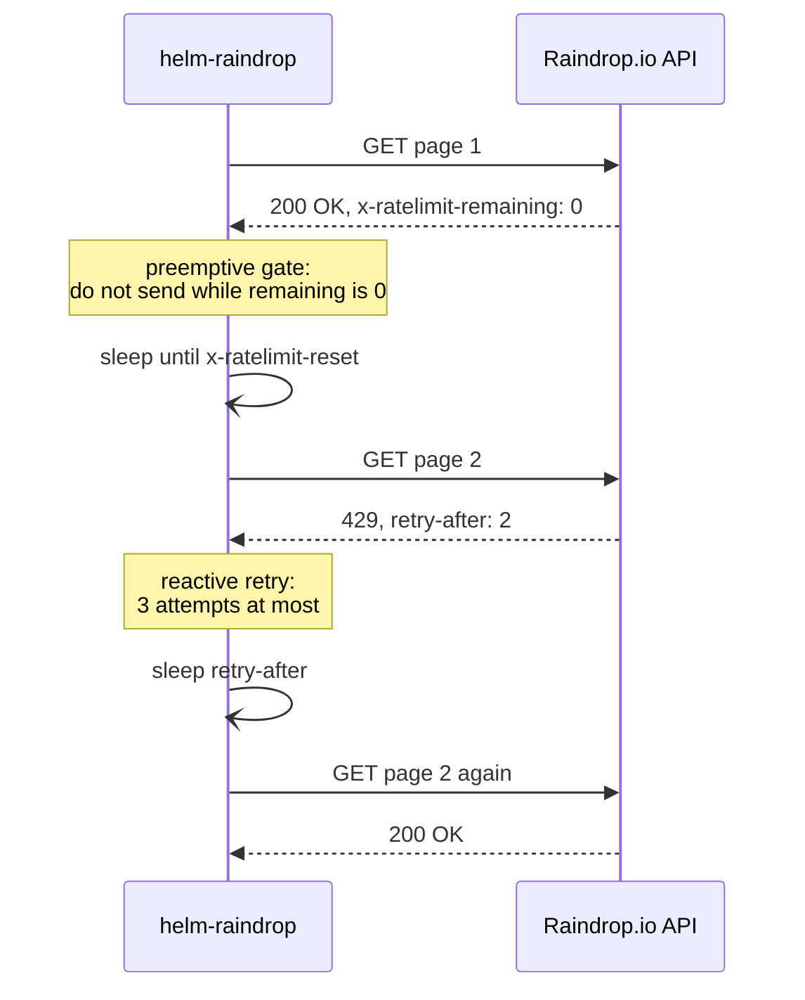

# Architecture

How `helm-raindrop.el` fills its cache file, `helm-raindrop-file`.

With a large collection, a single cache update fans out into hundreds of API requests. They are chained through `request.el` callbacks, throttled by two different kinds of waiting, and written to the file exactly once. This document maps that machinery.

## The collection and page loop

The Raindrop.io API returns at most 50 items per request, so every collection is walked page by page from page 0. A collection is finished when a page comes back with zero items, which costs one extra request per collection.

Items are accumulated in a hidden work buffer (`helm-raindrop--work-buffer-name`). Nothing reaches `helm-raindrop-file` until every collection has been fetched.



## One request, five outcomes

`helm-raindrop-do-http-request` is the whole loop. It takes a collection ID, a page number and a retry count, and every call ends in one of five ways. Three of them call it again, which is what keeps the loop turning; the dotted edges below are those self-calls.

The two solid end states are the only places where the session stops, and only one of them touches the cache file.



## Two kinds of waiting

The rate limit is handled in two places: one runs before a request is sent, the other after a 429 (Too Many Requests) comes back.

The **preemptive gate** reads `x-ratelimit-remaining` from every response. Once it hits 0, the next call stops *before* sending anything and sleeps until `x-ratelimit-reset`. It has no attempt limit, and it is what makes a full update occasionally take minutes rather than seconds.

The **reactive retry** only runs after the server has already answered 429. It sleeps for `retry-after` and tries the same page again, at most three times.



## Failure handling

Any error that is not a retryable 429 ends the session through `helm-raindrop-session-abort`: the collection queue is cleared and the work buffer is discarded without being written. A failed update therefore leaves the previous cache file untouched rather than replacing it with a truncated one.

The abort is always reported, regardless of `helm-raindrop-debug-mode`, because updates normally run from a timer where a silent failure would leave a stale cache unnoticed:

```
[Raindrop] Aborted: failed (error "peculiar") to GET https://api.raindrop.io/... (730.3sec) at 2025-09-26 16:17:32.  /Users/masutaka/.emacs.d/helm-raindrop was not updated.
```

A completed session logs a summary instead, when `helm-raindrop-debug-mode` is `info` or `debug`:

```
Wrote /Users/masutaka/.emacs.d/helm-raindrop
[Raindrop] Total: 235 requests completed for 2 collections (11521 items) in 129.9sec at 2025-09-27 13:04:42.
```

## Where each step lives

| Step | Function |
| --- | --- |
| Entry point, from `M-x` or the timer | `helm-raindrop-http-request` |
| One request and its branches | `helm-raindrop-do-http-request` |
| Rate limit gate | `helm-raindrop-ratelimit-exceeded-p` |
| Sleep until reset | `helm-raindrop-wait-for-ratelimit-reset` |
| "Any items in response?" | `helm-raindrop-next-page-exist-p` |
| Move to the next collection | `helm-raindrop-process-next-collection` |
| "429 and retry-count < 3?" | `helm-raindrop-should-retry-p` |
| Sleep `retry-after` and retry | `helm-raindrop-handle-ratelimit-error` |
| Write the cache file and stop | `helm-raindrop-session-finish` |
| Stop without writing | `helm-raindrop-session-abort` |
