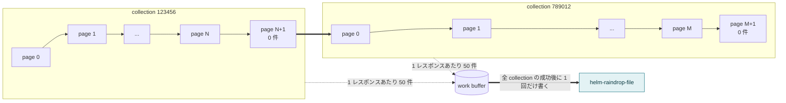
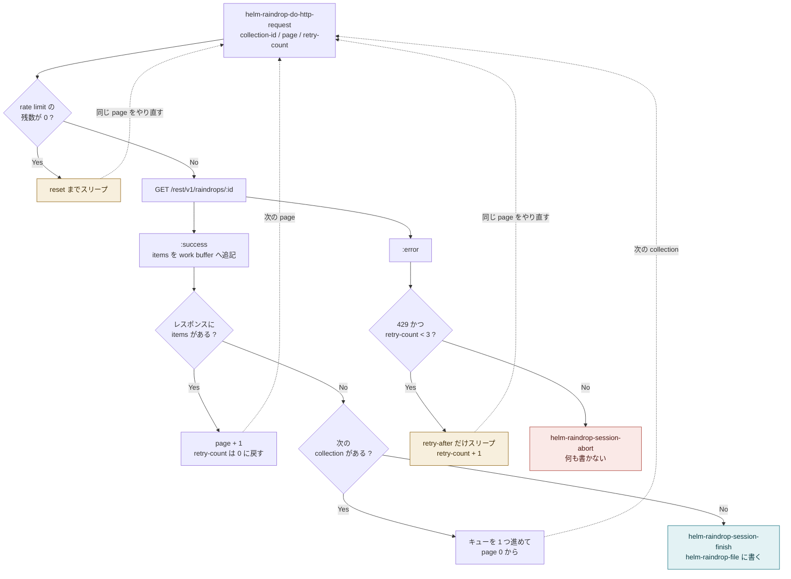
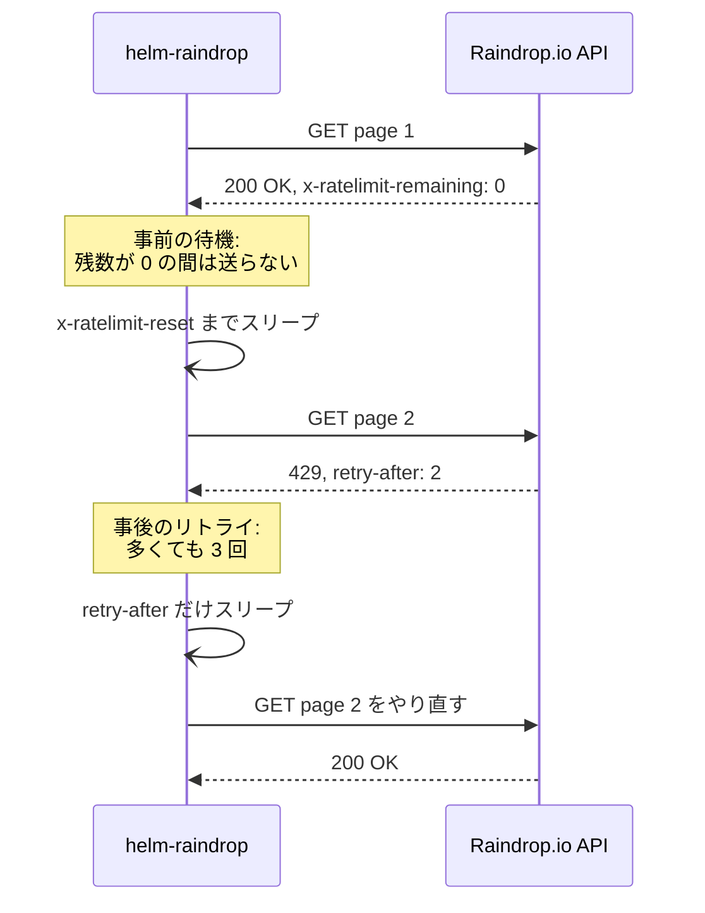

# Architecture

<p>
  <a href="./architecture.md"></a>
  <a href="./architecture_ja.md"></a>
</p>

`helm-raindrop.el` がキャッシュファイル `helm-raindrop-file` を作るまでの仕組みです。

アイテムが多いと、キャッシュを 1 回更新するだけで API リクエストは数百回に及びます。`request.el` のコールバックが次のリクエストを呼ぶ形で連鎖し、2 種類の待ち方で間隔が空き、最後にちょうど 1 回だけファイルに書き込みます。

## collection と page の二重ループ

Raindrop.io API は 1 リクエストにつき最大 50 件しか返しません。そのため collection ごとに page 0 から順にたどります。0 件のページが返ってきた時点でその collection は終わりとみなすので、collection 1 つにつき空振りのリクエストが 1 回入ります。

取得したアイテムは隠しバッファ（`helm-raindrop--work-buffer-name`）に溜め込みます。すべての collection を取り終えるまで `helm-raindrop-file` には何も書きません。



## 1 リクエストの 5 つの終わり方

ループの全体が `helm-raindrop-do-http-request` に収まっています。引数は collection ID、page 番号、リトライ回数の 3 つで、1 回の呼び出しは必ず次の 5 つのどれかで終わります。そのうち 3 つは自分自身を呼び直し、この 3 つがループを回します。下の図の点線がその自己呼び出しにあたります。

実線の終点は 2 つだけで、そこでセッションが止まります。キャッシュファイルに触れるのは片方だけです。



## 2 種類の待ち方

rate limit は 2 か所で扱っています。片方はリクエストを送る前に、もう片方は 429（Too Many Requests）が返ってきた後に動きます。

「事前の待機」では、すべてのレスポンスから `x-ratelimit-remaining` を読み取ります。これが 0 になると、次の呼び出しはリクエストを送る手前で止まり、`x-ratelimit-reset` までスリープします。回数の上限はありません。キャッシュの更新に数分かかることがあるのは、これが理由です。

「事後のリトライ」が動くのは、サーバーが 429 を返してきた後です。`retry-after` だけスリープして同じ page をやり直し、多くても 3 回でやめます。



## エラーの扱い

リトライ対象の 429 以外のエラーが起きると、`helm-raindrop-session-abort` を通ってセッションを終えます。collection のキューを空にし、work buffer は書き出さずに捨てます。更新に失敗したときは、前回のキャッシュファイルがそのまま残ります。途中までの内容で上書きすることはありません。

中断したことは、`helm-raindrop-debug-mode` の設定にかかわらず必ず message に出力します。通常はタイマーから更新が走るため、黙って失敗するとキャッシュが古いまま気づけないからです。

```
[Raindrop] Aborted: failed (error "peculiar") to GET https://api.raindrop.io/... (730.3sec) at 2025-09-26 16:17:32.  /Users/masutaka/.emacs.d/helm-raindrop was not updated.
```

正常に終わった場合は、`helm-raindrop-debug-mode` が `info` か `debug` のときにサマリーを出力します。

```
Wrote /Users/masutaka/.emacs.d/helm-raindrop
[Raindrop] Total: 235 requests completed for 2 collections (11521 items) in 129.9sec at 2025-09-27 13:04:42.
```

## 各ステップの実装場所

| ステップ | 関数 |
| --- | --- |
| 起動（`M-x` またはタイマー） | `helm-raindrop-http-request` |
| 1 リクエストとその分岐 | `helm-raindrop-do-http-request` |
| rate limit の残数チェック | `helm-raindrop-ratelimit-exceeded-p` |
| reset までスリープ | `helm-raindrop-wait-for-ratelimit-reset` |
| 「レスポンスに items がある ?」 | `helm-raindrop-next-page-exist-p` |
| 次の collection へ進む | `helm-raindrop-process-next-collection` |
| 「429 かつ retry-count < 3 ?」 | `helm-raindrop-should-retry-p` |
| `retry-after` だけスリープしてリトライ | `helm-raindrop-handle-ratelimit-error` |
| キャッシュファイルを書いて終了 | `helm-raindrop-session-finish` |
| 書かずに終了 | `helm-raindrop-session-abort` |
